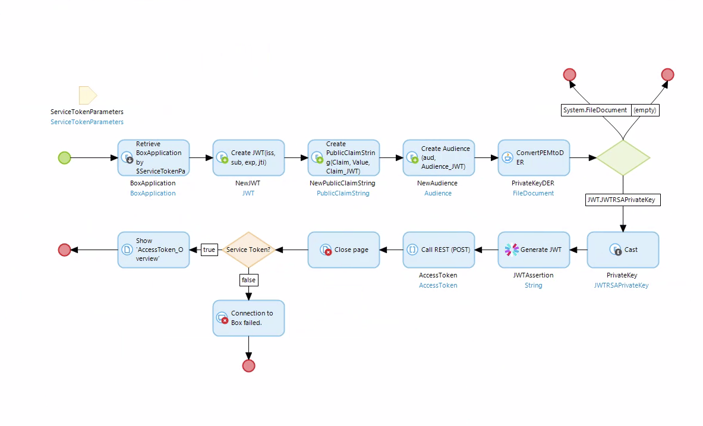

# Box Connector implementation in Mendix

The documentation that's given for the box connector is two years old, so some adjustments have to be made. There's also the possiblity that since the Box connector module was last updated in March 2017, that it won't work properly due to the fact that it's dependencies have been updated very recently, but here are my findings thus far.

I've also included some examples of how to use the Box API with microflows in the `api-examples` folder.

**Note** The codefiles in `src` don't all necessarily work. I've just been experimenting with them.

## Configuring DeepLink

_These steps are only necessary if you plan on using plain OAuth 2.0 without JWT to authenticate your application._

The documentation for the box connector says to configure DeepLink, but never mentions where you can do so. What I did was add the following page to my navigation: `DeepLink > Private > Pages/Snippets > DeepLinkConfig`. However, when you go to add a new DeepLink, you cannot edit the attributes `ObjectType`, `ObjectAttr`, `UseStringArg`, and `ObjectAsParameter`. To edit those, you will first need to edit the following snippet: `DeepLink > _Use me > Snippets > Deeplink_Details`. Somewhere, you'll need to add a way to edit the `UseStringArgument` and `UseObjectArgument` attributes somewhere in this snippet. I added checkboxes that reference those attributes.

Now you can navigate to the `DeepLinkConfig` page and add a new DeepLink. The box connector docs say to configure as follows:

```
Name                - 'grantaccess'
Microflow           - 'BoxConnector.GrantAccess'
ObjectType          - 'BoxConnector.GrantAccess'
ObjectAttr          - ''
AllowGuests         - true
UseStringArg        - true
UseAsHome           - false
IndexPage           - ''
IncludeGetParams    - true
SeparateGetParams   - true
ObjectAsParameter   - true
```
Make note of the URL that appears under the `Name` field when you create the DeepLink. If you need to see it again, just click the appropriate DeepLink and click `Edit`, and the URL will be there.

## Configuring the Box Connector

### Creating an Application

Again, the docs for creating a box application from the box connector docs is out of date, so the UI isn't the same, and you can't configure everything as is said in that documentation. Here's what I've done:

**Standard OAuth 2.0**

* Sign in to developers.box.com (I was able to use my existing account through BYU)
* Go to `My Apps`, and click `Create New App`.
* Choose `Enterprise Integration`
* Choose `Standard OAuth 2.0`
* Then give your application a name. Note that the name of application must be globally unique.
* Now go to the configuration menu of your app. This is found in the menu on the left hand side.
* Change your redirect URI to be the URL you noted from the DeepLink you created above. If you don't have that, check the instructions above to see how you can find that.
* Click `Save Changes` in the top left corner.

**OAuth 2.0 with JWT**

* Sign in to developers.box.com. (Use your NetID@byu.edu and password)
* Go to `My Apps`, and click `Create New App`.
* Choose `Enterprise Integration`
* Choose `OAuth 2.0 with JWT`
* Give your application a name. Bear in mind that the name must be globally unique.
* It should then redirect you to the configuration menu of your application. If not, you can access it in the menu bar on the left.
* Go down to `Add and Manage Public Keys`, and either add a public key or generate a key pair.
* If you generate a key pair, it will download a JSON file. Make sure to keep that file, since it has your Enterprise ID that you will need for later.

### Adding the Application to Mendix

What you'll need to do here is add a page to your navigation. The page is found under `BoxConnector > _USE ME > Administration > BoxApplication_Overview`. Then you'll need to navigate to this page and click `Add`. What parameters you need depends on the type of authentication you set for the box application. You'll want to delete the parameter rules for `Public Key`, `Public Key ID`, `Jti`, `State`, and `Redirect URI` on the entity `BoxApplication` in the Box Connector, otherwise you'll run into problems trying to add the applications to Mendix.

**Standard OAuth 2.0**

For Standard OAuth 2.0, you don't need the parameters for `Public Key`, `Public Key ID`, or `Jti`. Here are the parameters you'll need to worry about:

* **Name** - I don't think this one really matters. Put what you want here.
* **Client id** - Found in your application's configuration menu under `OAuth 2.0 Credentials`
* **Client secret** - Found in your application's configuration menu under `OAuth 2.0 Credentials`
* **Redirect uri** - Found in your application's configuration menu under `OAuth 2.0 Redirect URI`
* **State** - Also not sure what this is. The example puts it as `custom`.

**OAuth 2.0 with JWT**

When adding an application that has OAuth 2.0 with JWT, you don't need the parameters `Redirect Uri` or `State`, so you can delete the validation rules for those. Here are the parameters to worry about:

* **Name** - Same as Standard OAuth 2.0
* **Client id** - Same as Standard OAuth 2.0
* **Client secret** - Same as Standard OAuth 2.0
* **Jti** - This is a string that must be between 16 and 128 characters in length. It's used as a unique identifier for the JWT. I used the python function `secrets.token_hex(64)` to generate this.
* **Public Key** - This is actually supposed to be the unencrypted private key in PEM format. You can get the unencrypted key by copying the private key from the config.json file to an empty file, and then running the bash command `openssl pkey -in private.key`, replacing `private.key` for the name of the pem formatted file you just created. The command will prompt you for a passphrase, which is the passphrase in the same config.json file. It will then print the unencrypted private key.
* **Public Key ID** - Found under `Add and Manage Public Keys`.

**Create a BoxAccount Entity (Both)**

After you add an application to your Mendix app, you need to create a `BoxAccount` entity and associate it with the box application you just created. The page you need to access is `BoxConnector > _USE ME > Authentication > UI Sample > BoxAccounts_Overview`. You will also need to add a reference selctor to the `BoxAccount_NewEdit` page so you can actually associate your application with the `BoxAccount` entity. You can also add a column to the `BoxAccounts_Overview` page so you can see at a glance which accounts are associated with which applications. Access tokens are associated with these `BoxAccount` entities, so you'll need them later.

### Allowing your application to access Mendix

**Standard OAuth 2.0**

Now that you've gone through the arduous process of adding your application to Mendix, you can allow it to access Mendix with a couple extra steps. You will need to add an action button to the `BoxApplication_Overview` page, and have it call the following microflow: `BoxConnector > _USE ME > Authentication > UI Sample > LogInToBox`. Then navigate to the application overview page, and click the appropriate box application, and click the action button you created. Now this should redirect you to a box login page to allow your box application to access Mendix. Then it will redirect to the redirect URI you specified, which should call the `BoxConnector.GrantAccess` microflow.

**OAuth 2.0 with JWT**

You will need to create your own microflow to authenticate using a JWT, since the microflow that's given doesn't create a valid JWT. To do this, you will need Mendix's JWT module. Configure it as shown below (I'll include specifics on certain activites below):



* `ServiceTokenParameters` is an entity I created to pass in the enterprise ID/user ID and `BoxApplication` object to the microflow. They are both needed. The enterprise ID is found in the config.json file. The user ID is found under the user's account settings.
* Retrieve `BoxApplication` by association by `ServiceTokenParameters`.
* Create new `JWT` (from JWT module) with following properties:
  * `iss` - `$BoxApplication/ClientId`
  * `sub` -
  ```
  if $ServiceTokenParameters/EnterpriseID != empty
  then $ServiceTokenParameters/EnterpriseID
  else $ServiceTokenParameters/UserID
  ```
  * `exp` - `[%EndOfCurrentMinute%]`
  * `jti` - `$BoxApplication/Jti`
* Create new `PublicClaimString` (from JWT module) with the following properties:
  * `Claim` - `'box_sub_type'`
  * `Value` - 
  ```
  if $ServiceTokenParameters/EnterpriseID != empty
  then 'enterprise'
  else 'user'
  ```
  * `JWT.Claim_JWT` - `$NewJWT`
* Create new `Audience` (from JWT module) with the following properties:
  * `aud` - `@BoxConnector.BoxAPI_URL_Oauth2 + '/token'`
  * `JWT.Audience_JWT` - `$NewJWT`
* Call java action `ConvertPEMtoDER` (from JWT module) with the following values:
  * Pem key - `$BoxApplication/PublicKey` _Yes, it is supposed to be the Private Key, but the attribute name in the BoxConnector module is PublicKey_
  * Key type - _Private
  * Output file name - empty
* Cast output object to `JWT.JWTRSAPrivateKey`
* Add a `Generate JWT` activity with the following values:
  * Jwt object - `$NewJWT`
  * Secret - empty
  * Algorithm - `RS256` or `RS384` or `RS512`
  * Private key - `$PrivateKey`
* Make a REST call
  * General
    * Method - POST
    * Location - `{1}/token` _{1} is a parameter referencing_ `@BoxConnector.BoxAPI_URL_OAuth2`
  * Request
    * Template -
    ```
    grant_type=urn:ietf:params:oauth:grant-type:jwt-bearer&client_id={1}&client_secret={2}&assertion={3}
    ```
      * {1} is `$BoxApplication/ClientId`
      * {2} is `$BoxApplication/ClientSecret`
      * {3} is `$JWTAssertion`
  * Response
    * Response handling - Apply import mapping
    * Mapping - Find `BoxConnector > Implementation > RestMappings > Authentication > AccessToken_Import_Mapping` _The rest will autofill_

In order to be authorized to request a JWT, you have to have your application approved by whoever the "enterprise admin" is. When I contacted them, I just needed to make sure I wasn't asking for too many permissions, and they needed the Client ID to approve it. So I needed to set the permissions under `Application Scopes` on the config menu, and then give them the Client ID under `OAuth 2.0 Credentials`.

**Important** When you use the enterprise ID, the box application gets it own "account," meaning that when you first make API calls, it will tell you that you don't have any files or folders, simply because it's as though you created a new box account. So the files and folders created through the API this way can only be accessed through the API.

## Executing Deeplink

_This is only necessary if you're using Standard OAuth 2.0_

To do this, you need to call the `DeepLink > _Use me > Configuration > DeepLinkHome` microflow as your default homepage. Make sure to put an activity in there to show the default homepage if it returns false, since it won't show any pages on its own. It should be a general practice to show a page for any microflow you call through DeepLink.

The reason why the microflow needs to be called as the default home action, is because when you execute a microflow through a DeepLink, it automatically redirects to the homepage, and then executes the `DeepLinkHome` microflow which does the actual execution of the microflow.

## Making API Calls

This part is pretty easy. The box connector module comes with a microflow activity for most of the API calls listed in the documentation for Box's API. Simply build a microflow that uses these actions. You may need to do some digging in Box Connector's domain model to see what value some activities are looking for. For example, when you call the `Get Folder Items` activity, it asks for a `BoxFolder` object. In the Box API documentation, it states that the only required value is the folder id, so you can create a `BoxFolder` entity in your microflow, and then set the `_id` value to the appropriate id. That particular activity also asks for a few other things, but you get the idea. Unlike the rest of the module, figuring out the API calls is pretty straight-forward, since they coincide with the Box API documentation. (https://developer.box.com/reference)

### Example Microflows

**File**

* [Copy File](api-examples/file/CopyFile.md)
* [Download File](api-examples/file/DownloadFile.md)
* [Upload File](api-examples/file/UploadFile.md)

**Folder**

* [Get Folder Items](api-examples/folder/GetFolderItems.md)

## Some fallbacks

* This may not be the most effective way to handle your files since there is a good amount of tweaking that has to happen.

* There needs to be a good way of checking whether an access token is still valid so that there isn't a request made for an access token every time someone uploads a file.

## Other tweaks

Here are some tweaks you can make to the box connector module to make life a little bit easier.

### Expiration date and time on access tokens

One thing that's not very nice about the way access tokens are managed in the box connector module, is that you are only given the amount of seconds before a token expires. On top of that, the seconds don't exactly update, so it's just stuck on whatever number of seconds you initially had for the token. This little tweak makes it easier to know when the tokens will expire so you can manage them better.

* Add a `DateTime` attribute to the `AccessToken` entity in the box connector's domain model, and call it something like "expires" or "expires on"
* Add a before commit event handler to the `AccessToken` entity, and create a newmicroflow.
* In the newly created microflow, make sure that there is an `AccessToken`parameter. If you didn't create the microflow when selecting a microflow for theevent handler before, it probably won't be there.
* Add an activity that changes the `AccessToken` object. It will change the newattribute that you just created.
* The activity should then set that new attribute to the following expression:
```
addSeconds([%CurrentDateTime%], $AccessToken/expiresIn)
```
* Now save the microflow and run your app. Now when you request access tokens, the app will also store the time they expire.
