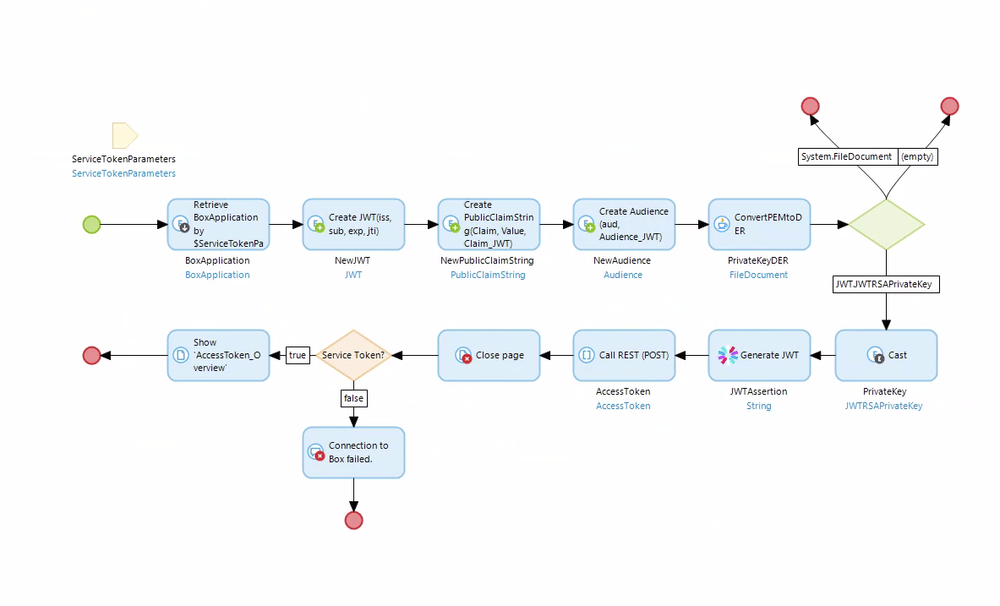
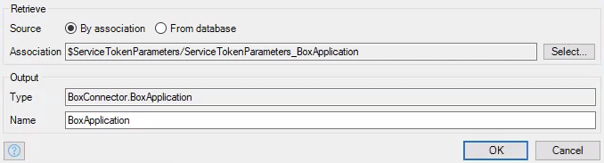
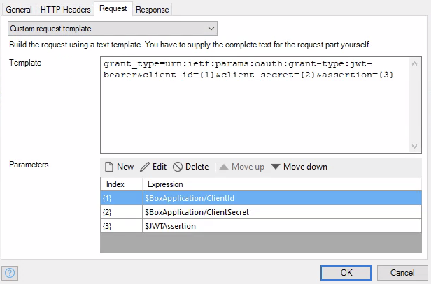

# Get Token Service Account \*\*BROKEN\*\*

This activity is completely broken. The implementation isn't done correctly, since it doesn't build the JWT the correct way. In particular, the encryption method used to sign the JWT is not one supported by the Box API, namely `HS256`. Then in the JWT header, it says the encryption method used is `RS256`. The supported algorithms are `RS256`, `RS384`, and `RS512`. The workaround I have requires an entirely new microflow, and it requires the JWT mendix module, so make sure you have that installed.

## New Microflow Implementation

This microflow will build the JWT from scratch, and request an access token through the Box API.

1) Find a way to pass in a UserID (String), EnterpriseID(String), and a `BoxApplication` object. I just created a non-persistable entity in the domain model that has the UserID and EnterpriseID as attributes, and an association to the `BoxApplication` entity in the box connector domain model, and called it `ServiceTokenParameters`.

2) Retrieve the `BoxApplication` object via the association in the `ServiceTokenParameters` object that was passed in.

3) Create a `JWT` object (found in the JWT module), and set the following values:
  * `iss` - The client ID found in the `BoxApplication` object.
  * `sub` - Set this to the enterprise ID if the enterprise ID is filled in, otherwise set it to the user ID. (Note, you do not need both.)
  * `exp` - Set this to be no longer than a minute after the current time. This is the expiration time for the JWT assertion (not the access token).
  * `jti` - Set this to be the Jti you set in the `BoxApplication` object.

4) Create a `PublicClaimString` object (found in the JWT module), and set the following values:
  * `Claim` - `'box_sub_type'`
  * `Value` - Either set this to `'enterprise'` if the enterprise ID is set, or to `'user'` if the user ID is set.
  * `JWT.Calim_JWT` - Set this to be the `JWT` object you just created.

5) Create an `Audience` object (found in the JWT module), and set the following values:
  * `aud` - This is the authentication URL for the box API. This is https://api.box.com/oauth2/token.
  * `JWT.Audience_JWT` - Set this to the `JWT` object you just created.

6) Call the `ConvertPEMtoDER` java action. Then set the following values:
  * Pem key - The unencrypted private key from the `BoxApplication` object. Note this may be stored in the `PublicKey` attribute. Also, I'm working on a way to decrypt an encrypted private key in Mendix.
  * Key type - `_Private`
  * Output file name - `empty`

7) Use an inheritance split to change the object type of the private key.

8) Cast the private key on the `JWT.JWTRSAPrivateKey` branch of the inheritance split. For this, just use the Cast activity, and name your variable.

9) Use the `Generate JWT` activity to then generate the actual JWT. Set the following values:
  * Jwt object - The `JWT` object we created in this microflow.
  * Secret - `empty`
  * Algorithm - This can be either `RS256`, `RS384`, or `RS512`.
  * Private key - The `JWTRSAPrivateKey` object that was created from the cast activity.

10) Create a `Call REST` activity, and configure it as show below. (Note that you don't have to add any HTTP headers.)

11) Close the current page with a close page activity.

12) Add an exclusvie split that checks to see whether an `AccessToken` object was created, or in other words an access token was received from the Box API. Use an expression like `$AccessToken != empty`.

13) If no token was created, display an error message. Otherwise, pass the `AccessToken` object to the `AccessToken_Overview` page which is found under `BoxConnector > _USE ME > Authentication > UI Sample`

