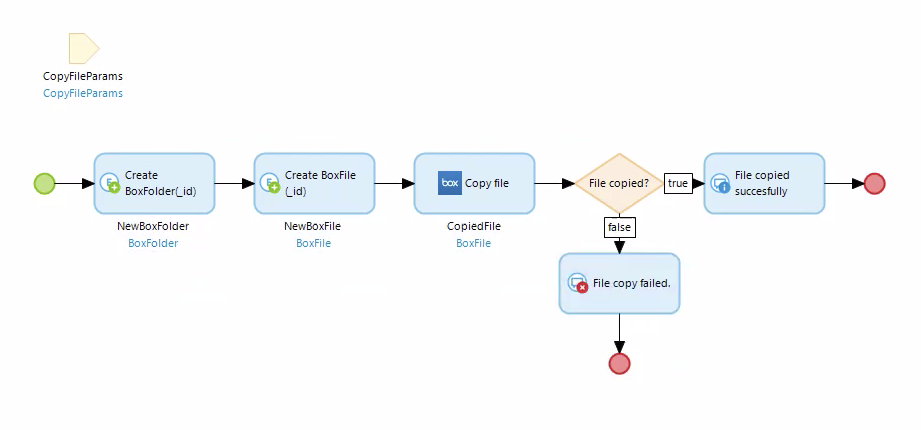
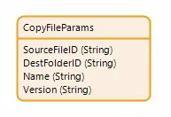
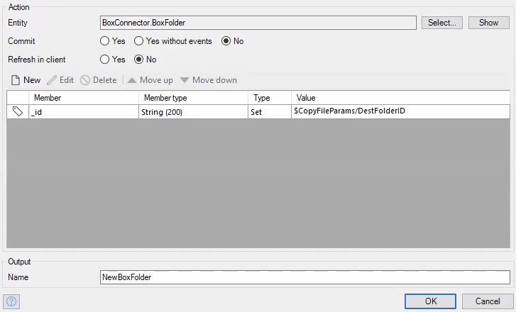
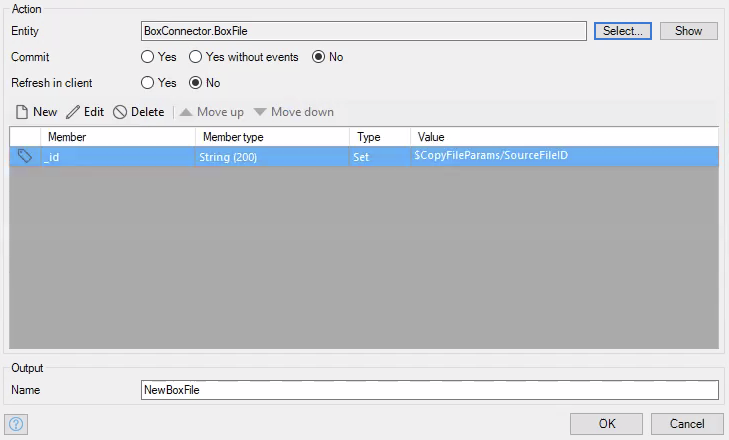
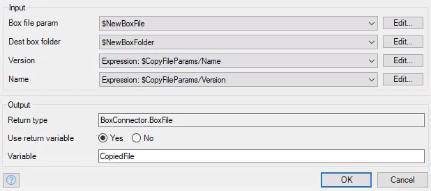
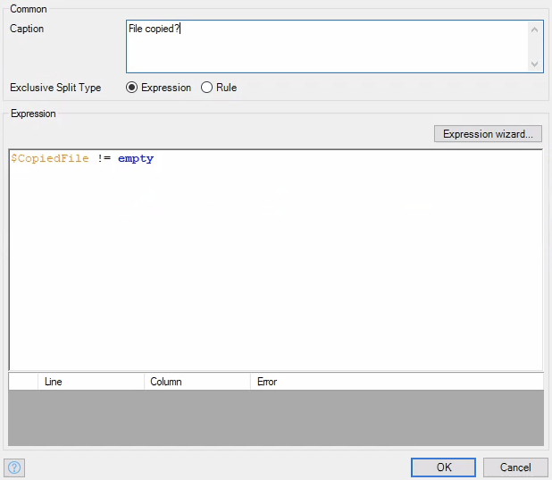

# Copy File

Copies a file based on given file ID to folder with given folder ID.

## Parameters

* _Required_ **Box file param** - A `BoxFile` object that represents the file to copy. Make sure the `_id` attribute is set.
* _Required_ **Dest box folder** - A `BoxFolder` object that represents the folder you wish to copy your file to. Make sure the `_id` attribute is set.
* **Version** - A string representing the version of the object you wish to copy.
* **Name** - A string representing the name of the file you copied.

## Return Value

A `BoxFile` object that represents the file you just copied.

## Microflow Example

This microflow takes a file ID and folder ID and copies the respective file to the respective folder.

1) Pass in the folder ID, file ID, version, and name of file. The way I did this was create a non-persistable entity that had all of these parameters as attributes, and prompted the user to create such an object.

2) Create a `BoxFolder` object that has its `_id` attribute set to the folder ID that was passed in.

3) Create a `BoxFile` object that has its `_id` attribute set to the file ID that was passed in.

4) Use the `Copy file` activity from the box connector module to then copy the file. Pass in all the parameters we just created.

5) You can also create an exclusive split that checks to see whether the file was copied. Give it an expression like `$CopiedFile != empty`.

