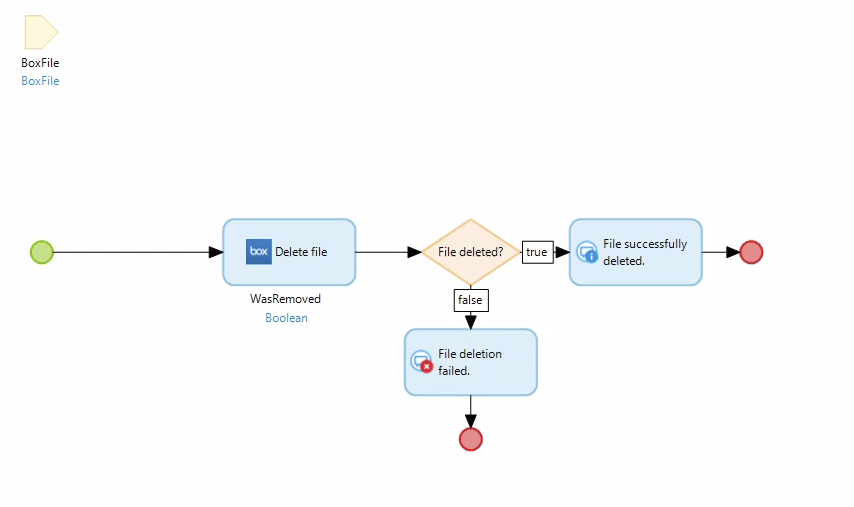
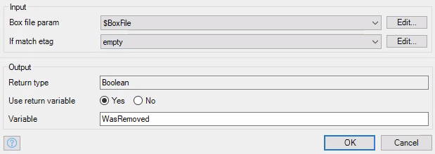
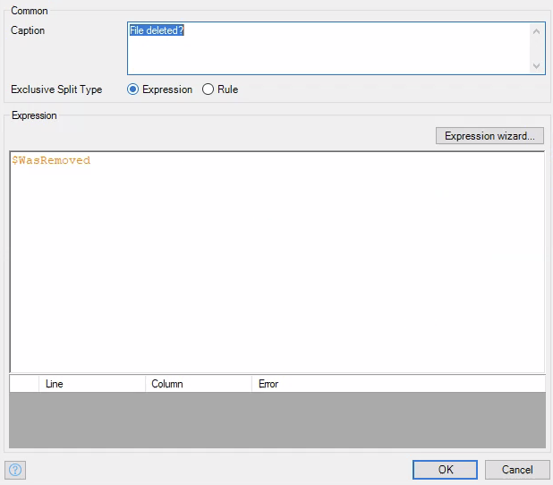

# Delete File

Deletes a file with given file ID.

## Parameters

* _Required_ **Box file param** - A `BoxFile` object that represents the file that you wish to delete. Make sure the `_id` attribute is set.
* **If match etag** - Deletes file if the given `etag` matches the file's `etag` property.

## Return Value

A boolean that is true if the file was deleted and false otherwise.

## Microflow Example

This microflow deletes a file with the file ID given by the user.

1) Pass in a `BoxFile` object that has the `_id` attribute set. This should represent the file that is going to be deleted.

2) Use the `Delete file` action from the box connector module and pass in the `BoxFile` object.

3) You can choose to check whether the file was deleted with an exclusive split. Give it an expression like `$WasRemoved`.

