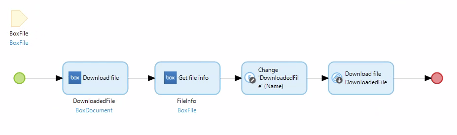
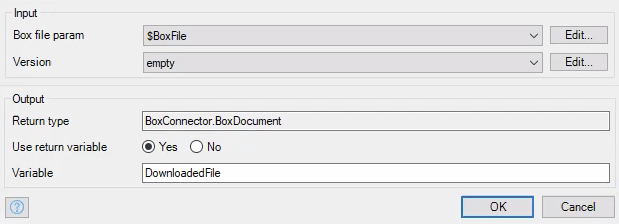
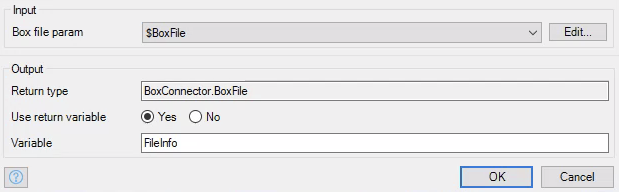
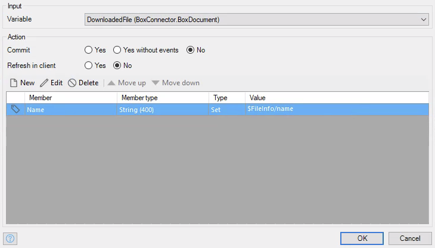
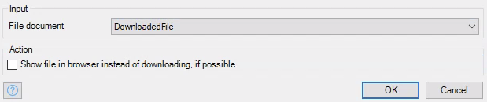

# Download File

This activity will download a file based on the file ID that is given to it.

## Parameters

* **Box file param** - A `BoxFile` object that represents the file you wish to download. Make sure that the `_id` attribute is set.
* **Version** - The version of that file you want to download. Can be set to `empty` to get the latest version.

## Return Value

A `BoxDocument` object that contains the contents of the file you wish to download. Note that this does not actually download the file.

## Microflow Example

This microflow will download a file based on the file ID that is given.

1) Pass in a `BoxFile` object that has the `_id` attribute set to the ID of the file you wish to download.

2) Use the `Download file` activity from the box connector and pass in the `BoxFile` entity as your box file parameter.

3) Use the `Get file info` activity to get the name of the file you want to download. Pass in the `BoxFile` object. This is necessary since Mendix does not save the name of any file you upload, and it doesn't automatically grab the name of the file when you download it. If you don't get the name, it will download the file under the name `BoxDocument`, instead of whatever the name of the actual file is.

4) Change the `BoxDocument` object so that its name is the name you just grabbed from the `Get file info` activity.

5) Download the file using Mendix's `Download file` activity.

