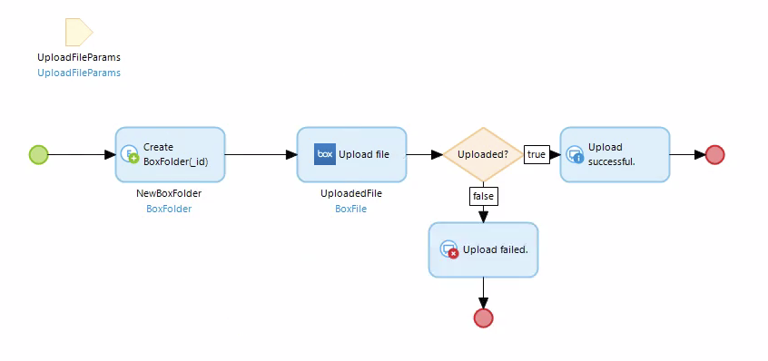
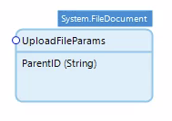
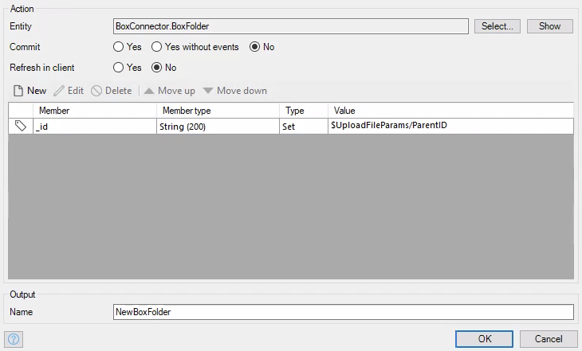
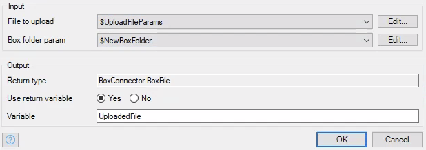
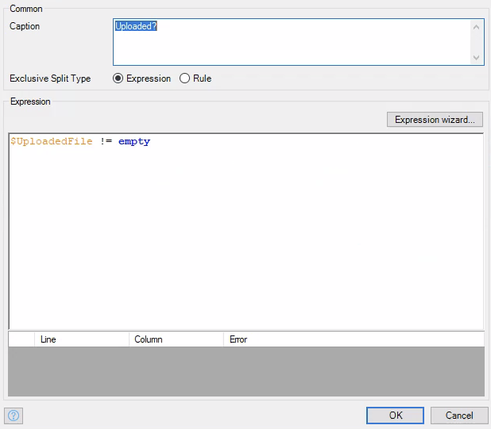

# Upload File

This activity uploads a file to box.

## Parameters

* **File to upload** - A `System.FileDocument` object or an object with the `System.FileDocument` specialization. This is the file you will upload.
* **Box folder param** - A `BoxFolder` entity. This is the folder that you are uploading the file to.

## Return Value

A `BoxFile` object that is the file you just uploaded.

## Microflow Example

This microflow will upload a file given by the user.

1) Find a way to pass in the id of the folder you want to upload to and a `System.FileDocument` object. The way I did it was create a new entity that was a specialization of the `System.FileDocument` entity and has an `_id` attribute that's a string.

2) Create a `BoxFolder` object that sets the `_id` attribute to the id that was passed in.

3) Use the `Upload file` activity from the box connector module to upload the file. Pass in the parameter we passed in to the microflow and the `BoxFolder` object we just created.

4) This isn't necessary, but you can create an exclusive split that will check to see whether the file was uploaded.

