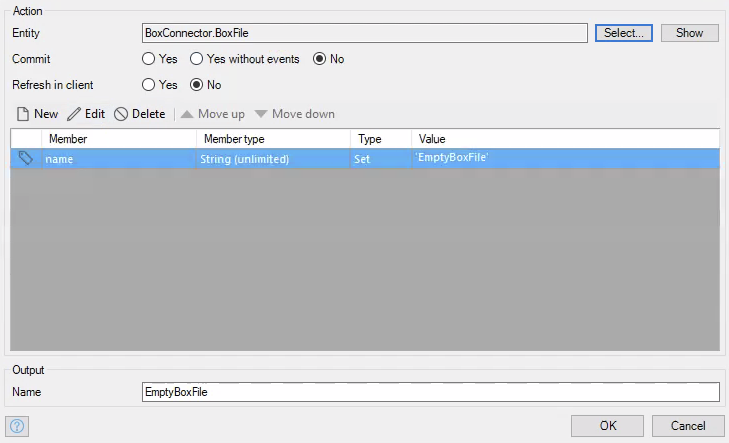
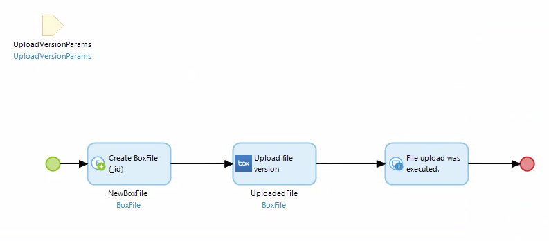
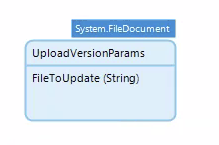
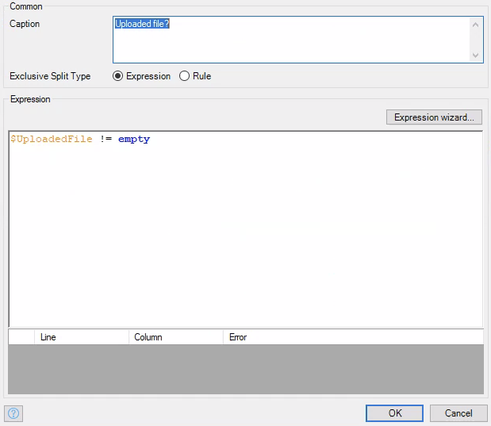

# Upload File Version \*\*BROKEN\*\*

Upload a new version for an existing file. 

## How to Fix

This function is broken as is, and you will need to fix it if you wish to use it. To fix this one, go to the project directory, and find `javasource/boxconnector/actions/UploadFileVersionCall.java`. Then on line 64, change
```java
postMethod.setRequestHeader("Authorization", "Bearer " + this.AccessTokenParam);
```
to
```java
postMethod.setRequestHeader("Authorization", "Bearer " + this.AccessTokenParam.gettoken());
```
The variable `AccessTokenParam` is an object that contains the access token, but isn't the access token itself, so if this isn't changed you will get a 401 error, or `Authentication error` (See [Short Errors](../../troubleshooting/ShortErrors.md))

Also, if you want feed back on whether the file was actually uploaded, you'll need to adjust some things in the actual implementation microflow of this API call. This microflow is found under `BoxConnector > Implementation > API > File > UploadFileVersionImpl`. This is because a successful upload returns a 201 "error" code, which Mendix sees as an error. Here's what you'll need to do:

**Old Microflow**


**Adjusted Microflow**


1) After the error handler on the java action `UploadFileVersionCall`, add an exclusive split that checks to see if the error code 201.


2) If the split returns false, continue with the error handling that's already there. If the split returns true, create a new `BoxFile` object that sets at least one attribute like so:



3) Then return the `BoxFile` object you just created.

This way, the `Upload file version` activity will still return a `BoxFile` object, even if Mendix thinks that an error occured, and the existing error handling won't be broken.

## Parameters

* _Required_ **Box file param** - A `BoxFile` object representing the file you are uploading a new version for. Make sure the `_id` attribute is set.
* _Required_ **File to upload** - A `System.FileDocument` object or a specialization of `System.FileDocument`. This is the actual file you are uploading.

## Return Value

Now, the return value is supposed to be the updated file. However, a successful upload returns a 201 response code, which Mendix sees as an error. Thus an error will always be returned on a successful upload. Using the trick above will make it so that you do get feedback on whether the file was actually uploaded, however it doesn't give the object response you may be looking for. I'm looking into a way to fix this, but for now we'll just have to deal.

## Microflow Example

This microflow will upload a file and then give feedback on whether it was successful.



1) Find a way to pass in the ID of the file you wish to update and the `System.FileDocument` object that contains the updated file you wish to upload. I simply created a new entity that had a string attribute for the file ID, and was a specialization of `System.FileDocument`.



2) Create a `BoxFile` object that has its `_id` attribute set to the file ID you passed in. This represents the file you wish to update.


3) Use the `Upload file version` activity from the box connector module, and pass in the `BoxFile` object you just created and the object with the `System.FileDocument` specialization you passed in to the microflow itself.


4) Use an exclusive split to see if the previous activity returned a `BoxFile` object with an expression like `$UploadedFile != empty`, and display a message based on the outcome.


