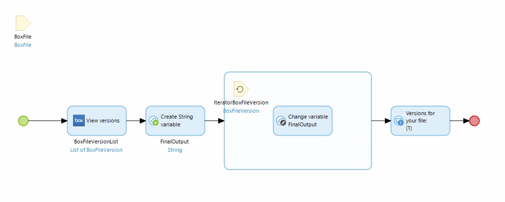
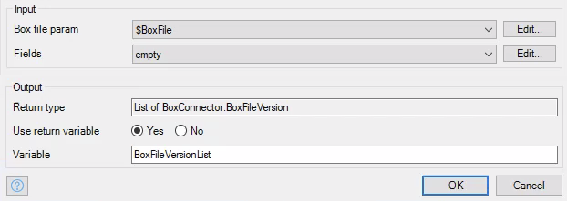
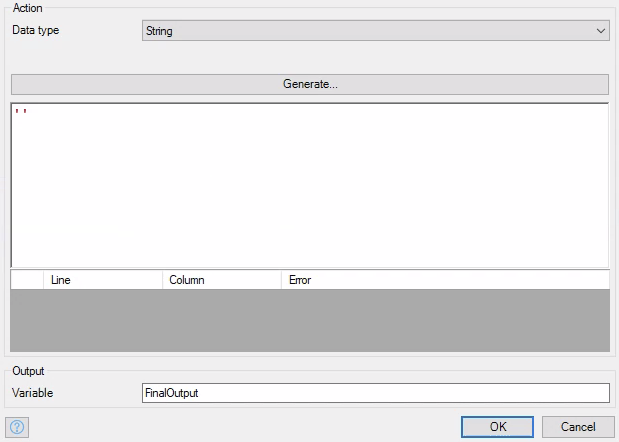
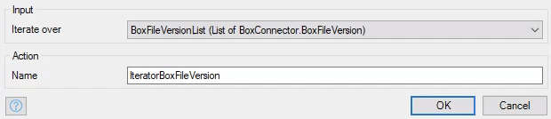
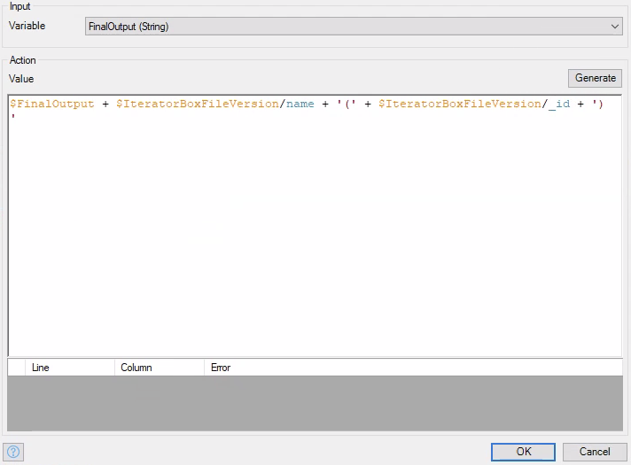
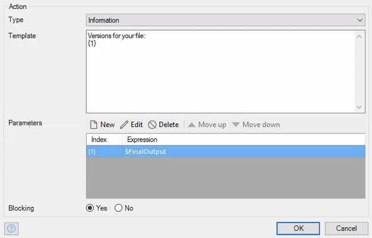

# View Versions

Will retrieve older versions of a file based on given file ID.

## Parameters

* _Required_ **Box file param** - A `BoxFile` object that represents the file that you want to retrieve the versions of.\
* **Fields** - A list of `BoxVersionFields` objects. The list of fields you wish to include in the response.

## Return Value

A list of `BoxFileVersion` objects that contain information on the previous versions of the file.

## Microflow Example

This microflow will retrieve the previous versions of a file and print out the file name and the version ID in a system message.

1) Pass in a `BoxFile` object that has the `_id` attribute set.

2) Use the `View versions` activity from the box connector module, and pass in the `BoxFile` object.

3) Create a string variable initialized to an empty string.

4) Iterate over the list of `BoxFileVersion` objects created by the `View versions` activity, and change the string variable on every iteration to include the name and id of the file version.

5) Then use the `Show message` activity to print out the result of the string.

