# Get Folder Items

This microflow will get the items inside a specified folder and list the item names with their ids in a system message.

## Required Values

* **Box folder param** - A `BoxFolder` entity that specifies which folder you want the items of. When you create a `BoxFolder` entity to pass into this microflow, make sure that at least the `_id` property is given.
* **Limit** - An Integer/Long that specifies the limit of items you want the action to return.
* **Offset** - An Integer/Long that specifies which item you want to start listing from.
* **Fields** - A list of `BoxItemFields` entities whose purpose I'm not sure of. Initially I thought it was for which fields the action would return, but I can access fields that I didn't list in that list, so I don't know.

## Return value

This will return a list of `BoxItem` entities that are found inside the given folder.

## Microflow Example

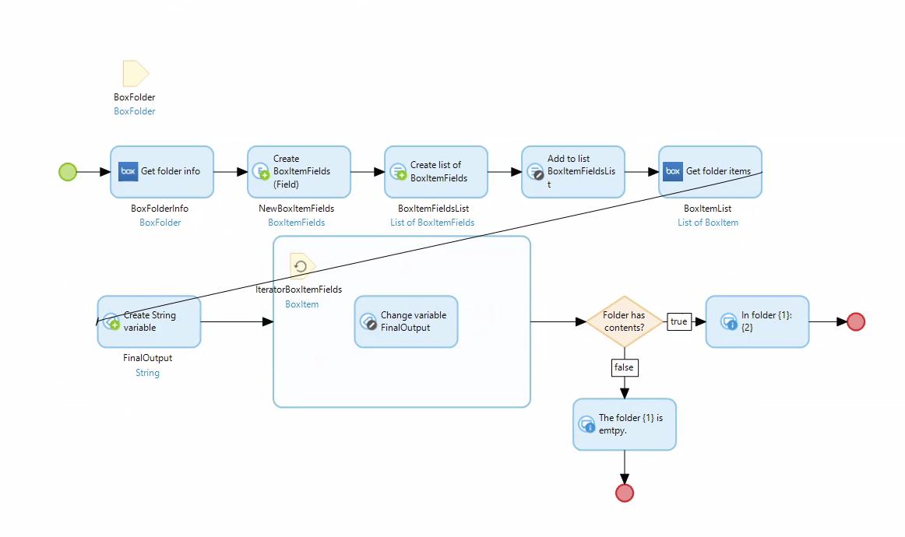

1) Pass in a `BoxFolder` entity from a page that prompts the user for the id of the desired folder.

2) _Optional_ Use the `Get folder info` activity to get the name of the folder based off of the `_id` attribute of the `BoxFolder` entity that got passed in.
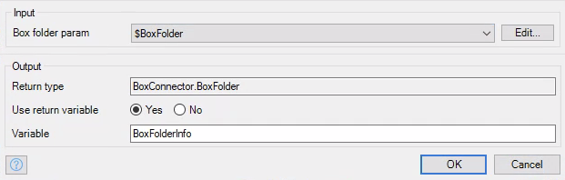

3) Create a `BoxItemFields` entity and set its value to `BoxConnector.BoxItemField.name`.
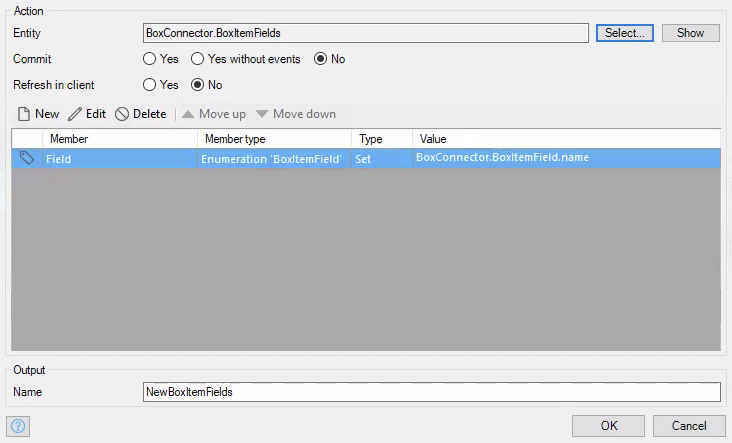

4) Create a list of `BoxItemFields` entities.

5) Add the previously created `BoxItemFields` entity to that list.
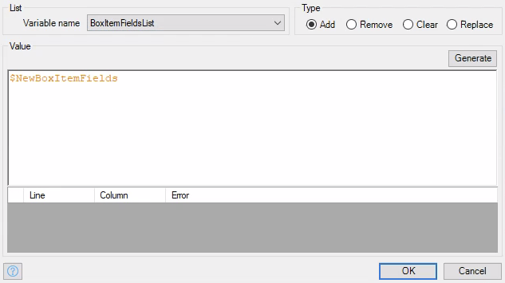

6) Call the `Get folder items` activity and pass in the `BoxItemFields` list we just created, the `BoxFolder` entity from the parameter, and set the desired numbers for `Limit` and `Offset`.
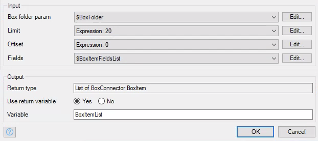

7) Create a string variable that's initialized to an empty string. This is the string that will be used for the system message.
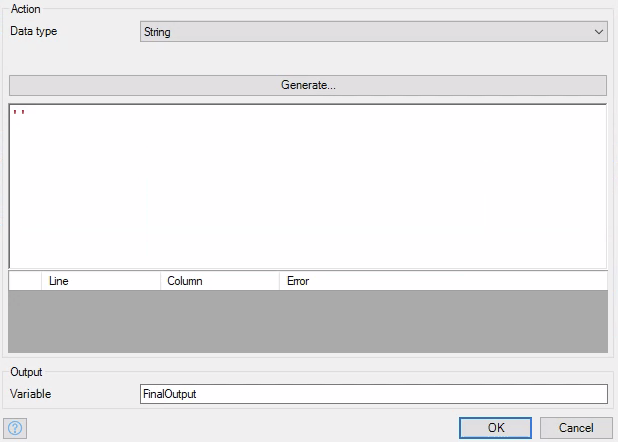

8) Iterate over the list of `BoxItem` entities that the `Get folder items` activity returned. On every iteration, change the string to be the string concatenated with the name of the `BoxItem` entity and a newline.
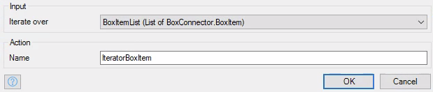
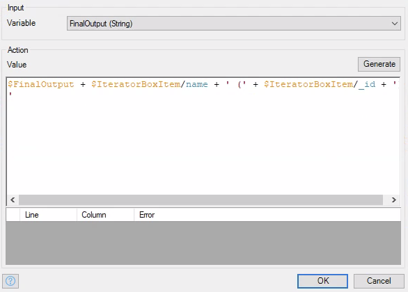

9) Add an exclusive split that checks to see if the list of `BoxItem` entities actually has contents, so something like `$FinalOutput != ''`. Then if true, print the string we created, if not say that the folder was empty.
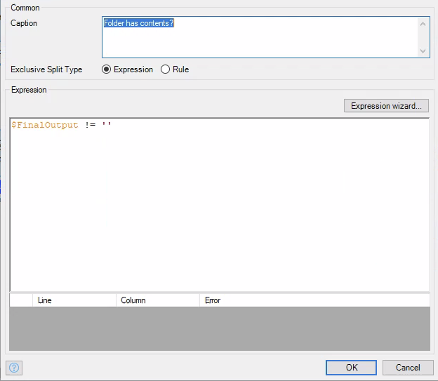
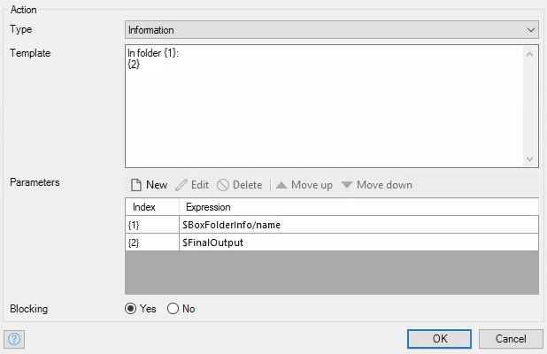
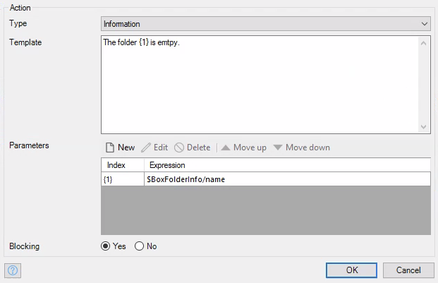
