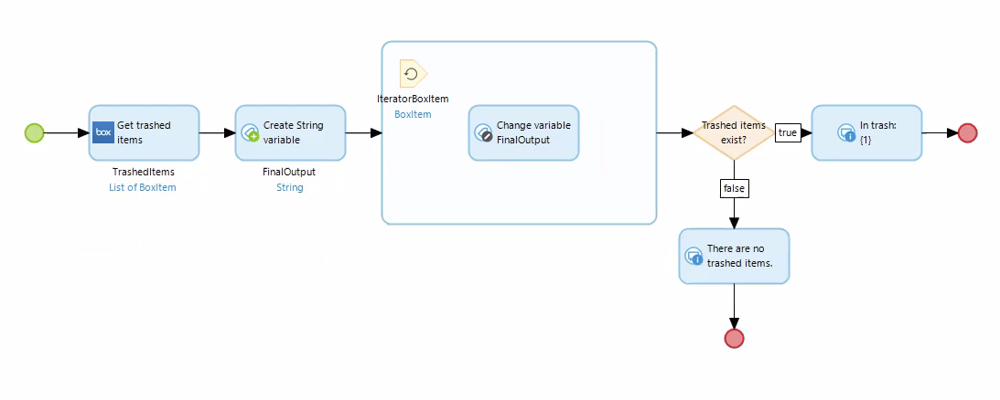
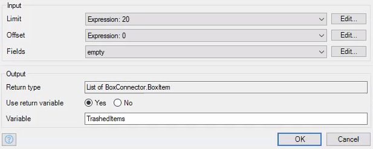
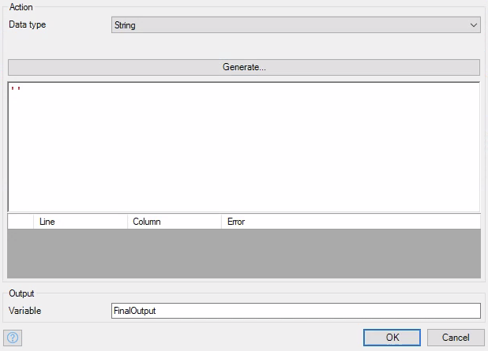
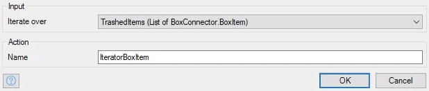
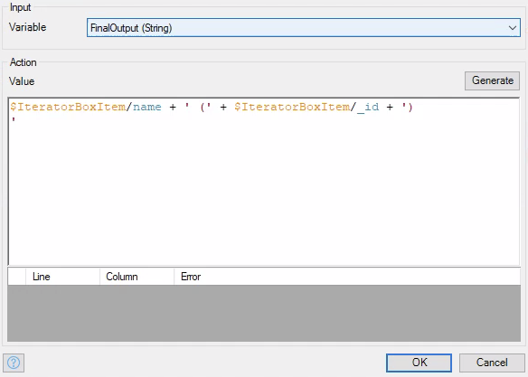
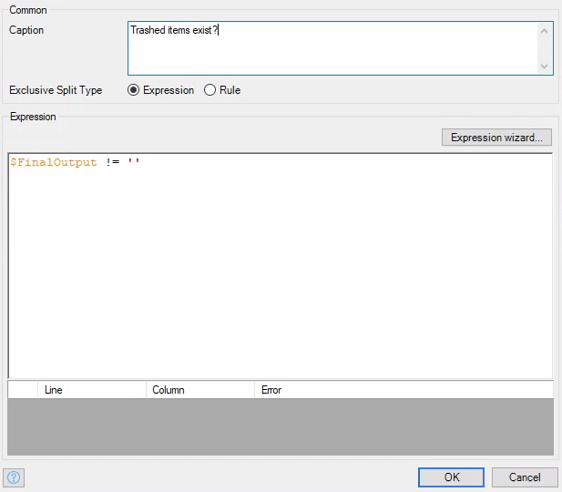

# Get Trashed Items

Gets all items currently in the trash.

## Parameters

* **Limit** - An integer specifying the limit of `BoxItem` objects the activity should return.
* **Offset** - How many items down the list the activity should start retrieving `BoxItem` objects.
* **Fields** - A list of fields to include in the response. Needs to be a list of `BoxItemFields` objects.

## Return Value

A list of `BoxItem` objects that represent the items in the trash.

## Microflow Example

This microflow retrieves 20 items from the trash and displays them in a message.

1) Use the `Get trashed items` activity, and set the desired attributes for `Limit` and `Offset`. Set `Fields` to `empty`.

2) Create a string variable initialized to an empty string.

3) Iterate over the list of `BoxItem` objects created by the `Get trashed items` activity, and print out the name and id of each object as shown.

4) Optionally add an exclusive split to check if there are in fact items inside the trash folder. Use an expression like `$FinalOutput != ''`.

